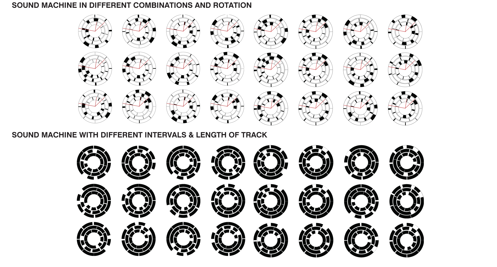

# COSMIC-PULSES
"Sound Architecture Machine"-Explore the Interactive Relationship between Sound, Human Activities and Architecture

## INTRODUCTION
Architecture space always serves human beings, and the main task of architects is to design spaces that are suitable for human beings. But does the so-called “human-friendly” space designed by architects really meet people’s needs? Therefore, the adaptability of space should be determined by people’s activities in the space.

Why human beings need to move in architecture space, they need a purpose to pull them to generate motivation, so human beings and architecture need a motivation or a factor to coordinate. Music is a great factor. 1970s, the birth of avant-garde music, avant-garde music composers usually use symbolic notation to record the notes, melody, and rhythm, etc., the music creates new graphic combinations of characteristics, and graphics also form a new music, the music is also a new graphic combination of characteristics. The music created new graphic combinations and the graphics created new musical forms, an interaction that can be translated to music, architecture and human activity. Nature is boundless, it symbolizes freedom, similar to the freedom of movement in architecture space, so eco-accoustic is a kind of musical freedom of movement.

## SOUND SELECTED
### Stackhausen's piece "COSMIC PULSES" ###
*Cosmic Pulses* is the 13th "hour" of Stockhausen's originally-planned 24-part cycle KLANG ("SOUND") which is based on the 24 hours of the day. Thiselectronic work is composed of 24 layers of synthesizer-generated melodic material, with each layer having a different speed and pitch register. The layers enter one by one, starting from the lowest/slowest layer, and go up in sequence to the highest/fastest layer.

  
  

### ECOACOUSTICS ###
Ecoacoustics is an interdisciplinary science that investigates natural and anthropogenic sounds and their relationship with the environment over a wide range of study scales, both spatial and temporal, including populations, communities, and landscapes. Ecoacoustics operates in all types of terrestrial and aquatic (freshwater and marine) ecosystems.

## SOUND MACHINE PRINCIPLES ##
### Rule 1 ###
**Players**: 24 Different Sounds, 8 from each of 3 categories- Anthro, Bio &Geophony

**Gameboard**: Wheel with 3 Concentric Rings of Different Sounds

**Rule**: 
- Play of 24 sounds in different combinations
- 8 sounds in 3 layers playing in random orders but fixed time intervals
- Time Interval between each sounds is according to the Fibonacci Series

**Result**: The result is a creation of a unique soundmachine in each combination

